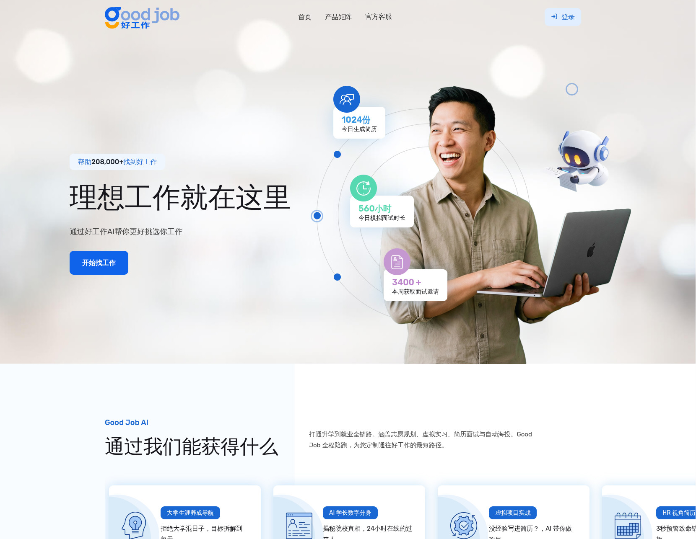
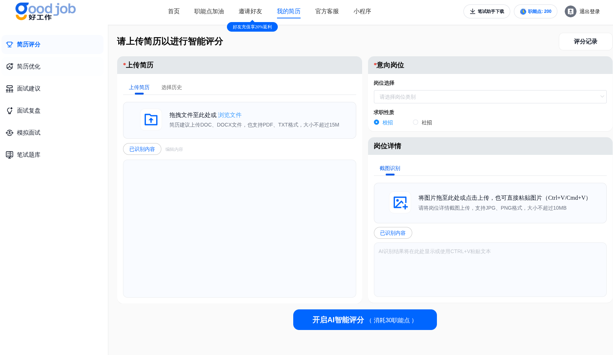
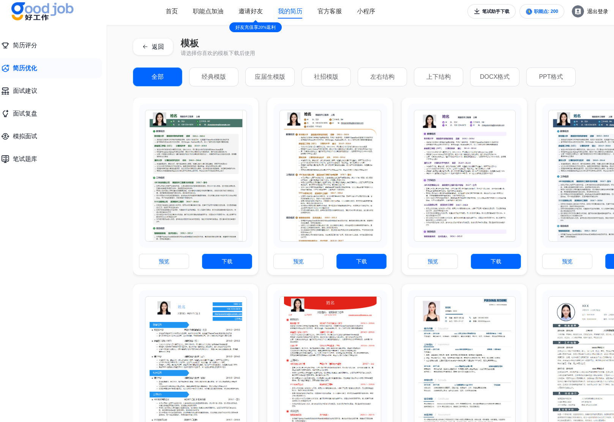
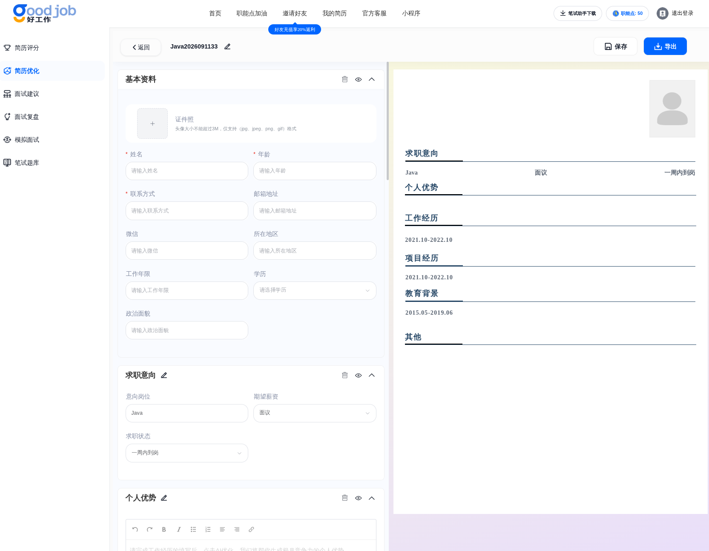
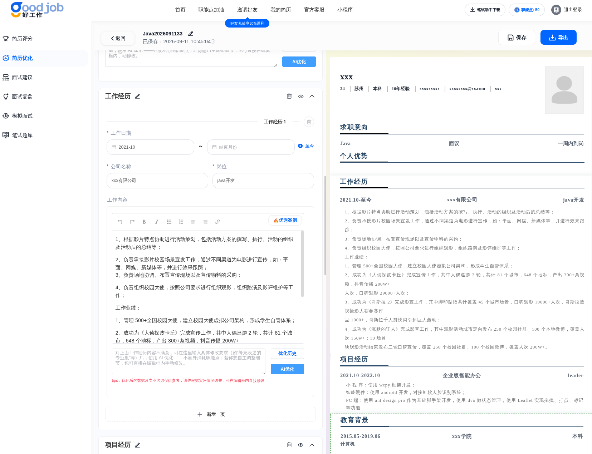

# AI简历小助手

## 简介

AI 驱动的简历生成与面试助手系统，支持多端交付：Web 管理后台、PC 桌面端、移动端小程序和 App。Java 后端 + Vue 前端 + Electron 桌面框架。

## 技术栈

### 后端 (AIResume-java)

- **框架**: Java, Spring Boot 2, JPA, MyBatis-Plus
- **安全**: SpringSecurity + JWT
- **数据库**: MySQL, Redis, Druid
- **移动**: uniapp (H5 + 小程序 + App)

### 前端 (AIResume-web / AIResume-www)

- **管理后台**: Vue 2, Element UI
- **H5**: uniapp v3.1 兼容

### 桌面端 (AIInterviews-electronegg)

- **框架**: Electron-egg v4 (跨平台桌面)
- **技术**: Node.js 桌面打包，支持 Windows/Mac/Linux

## 核心功能

- AI 简历生成与优化建议
- 模拟面试提问与评分
- 用户管理与认证
- 多端：Web 管理后台 + 移动端小程序/App + PC 桌面端

## 链接

- 生产: [https://www.aijlzsgoodjob.cn/](https://www.aijlzsgoodjob.cn/)

## 示例

