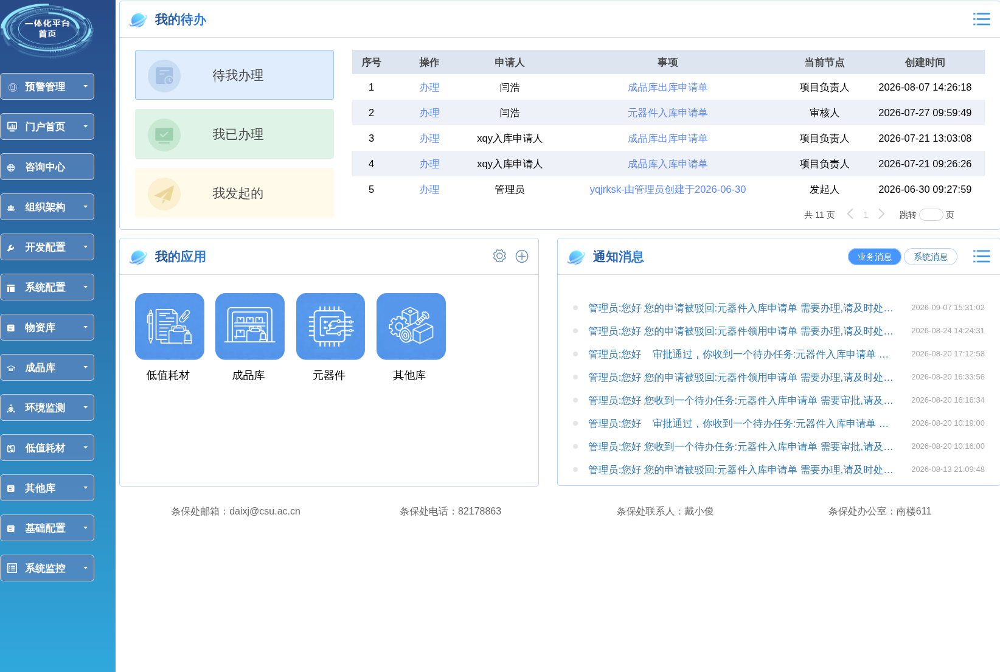

# 北京仓储

## 简介

北京企业仓储管理系统，基于青云 Stonewomb V4 低代码平台开发。支撑元器件、壳体、成品库、低值耗材等多业务线，实现入库、出库、库存、盘点、调拨全流程管理。

## 技术栈

- **后端**: Spring Boot 2.1.18, MyBatis, Activiti 5.18
- **前端**: JSP + MiniUI + jQuery
- **数据库**: 达梦 DM8
- **部署**: Docker, Git 自动部署脚本

## 核心功能

- 多仓库管理：元器件、壳体、成品库、低值耗材
- 仓储全流程：入库、出库、库存、调拨、移库、盘点、损益
- 工作流审批：基于 Activiti 的流程管理
- 租户权限：多租户架构，数据隔离

## 链接

- 基于甲方要求，不便演示

## 示例

