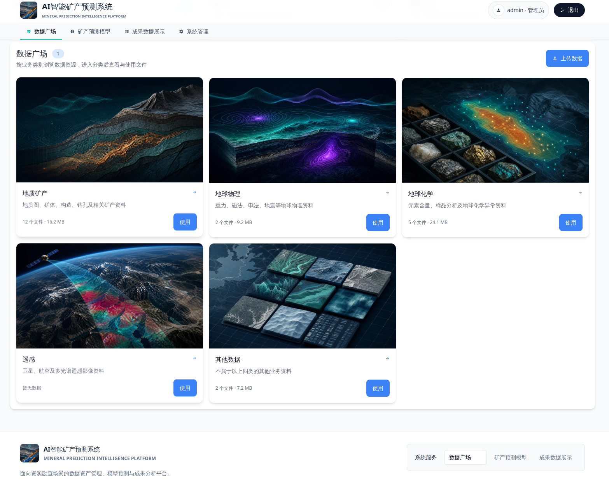
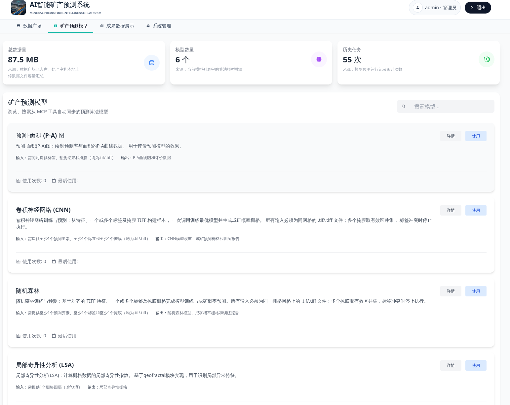
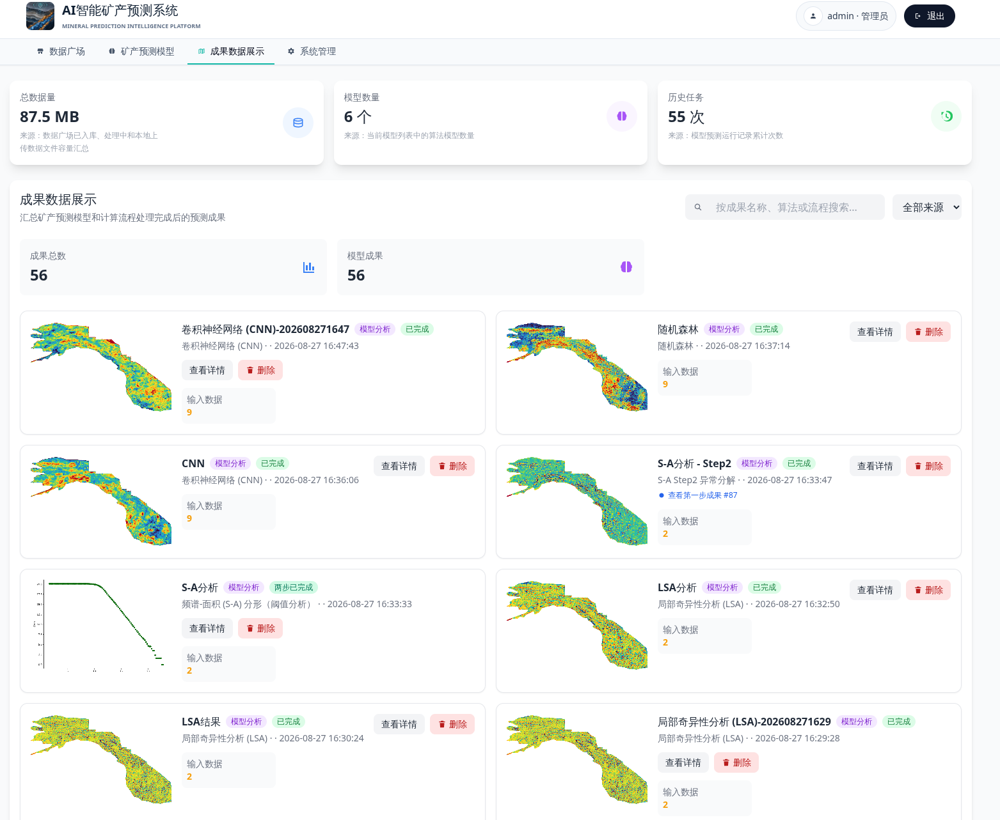
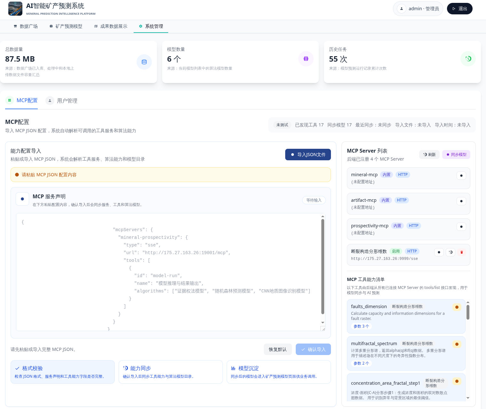

# AI 矿产预测平台

## 简介

AI 矿产预测平台，包含前端、可视化、算法与后端服务完整闭环。基于 Python + FastAPI + MySQL 构建 LLM 编排层，Celery + Redis 处理异步任务，前端采用 React + TypeScript 构建交互界面，MCP 协议封装13种矿产预测算法供 AI 调用。

## 技术栈

### 后端 (AIMPS)

- **框架**: Python 3.12+, FastAPI (异步), SQLAlchemy 2.0 (async)
- **数据库**: MySQL 8.0
- **异步任务**: Celery + Redis
- **LLM**: OpenAI SDK → DeepSeek（Provider 抽象，支持扩展）
- **认证**: JWT (python-jose + passlib)
- **协议**: MCP (Model Context Protocol)，支持 stdio + HTTP 双协议
- **部署**: Docker Compose

### 前端 (AIMPS-FRONTEND)

- **框架**: React 18, TypeScript, Vite
- **样式**: TailwindCSS + @tailwindcss/typography
- **图表**: Recharts, @xyflow/react (流程图)
- **地图**: OpenLayers + proj4 (GIS 集成)
- **路由**: React Router v7
- **构建**: pnpm workspaces，单命令构建

### 算法服务 (AIMPS-MCP)

- **协议**: MCP Server，Python 实现
- **算法**: 13种非线性矿产预测算法，包括断裂分形密度、多重分形谱、浓度-面积分形、频谱-面积分形、局部奇异性分析、t检验、SOM 自组织映射、随机森林、卷积神经网络、SHAP 分析等
- **依赖**: scikit-learn, Shap, TensorFlow/PyTorch, GDAL, geopandas

## 核心功能

- AI 模型调用编排与路由（DeepSeek Provider 抽象）
- MCP Function Calling 任务管理（stdio + HTTP 双协议）
- 异步任务队列处理（Celery + Redis）
- JWT 用户认证与权限管理
- 地质数据资产管理（数据资产、预测模型、预测结果、工作流）
- 矿产预测算法封装为 MCP 工具，AI 可直接调用

## 链接

- 甲方项目，不便演示

## 示例

