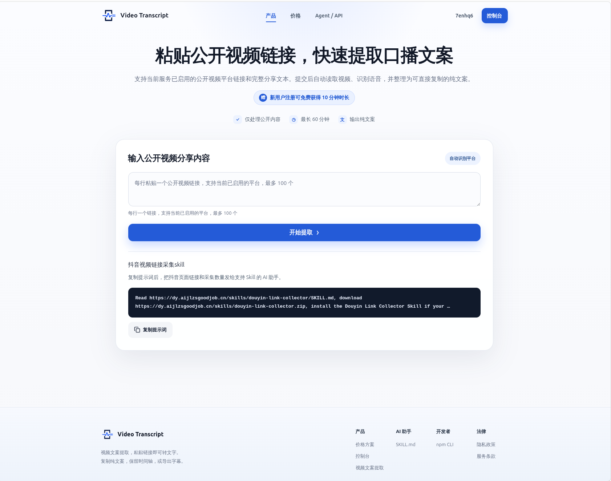

# 抖音文案助手

## 简介

面向抖音、小红书、视频号公开视频的**文案提取与转写服务**。支持单视频和抖音批量队列提取，输出字幕、OCR、ASR 文稿。提供用户认证、套餐订单、额度账本和持久化任务队列。

## 技术栈

- **后端**: Python, FastAPI, SQLAlchemy, MySQL, Redis, Docker
- **前端**: React 18, TypeScript, Vite, TailwindCSS, Zustand
- **管理员后台**: 独立 Vue 前端
- **部署**: Docker Compose（后端）+ Nginx（前端）

## 核心功能

- 多平台支持：抖音 / 小红书 / 视频号
- 抖音批量队列提取
- 字幕 / OCR / ASR 文稿生成
- 用户套餐与额度管理
- TXT / SRT / VTT 导出

## 链接

- 生产: [https://dy.aijlzsgoodjob.cn/](https://dy.aijlzsgoodjob.cn/)

