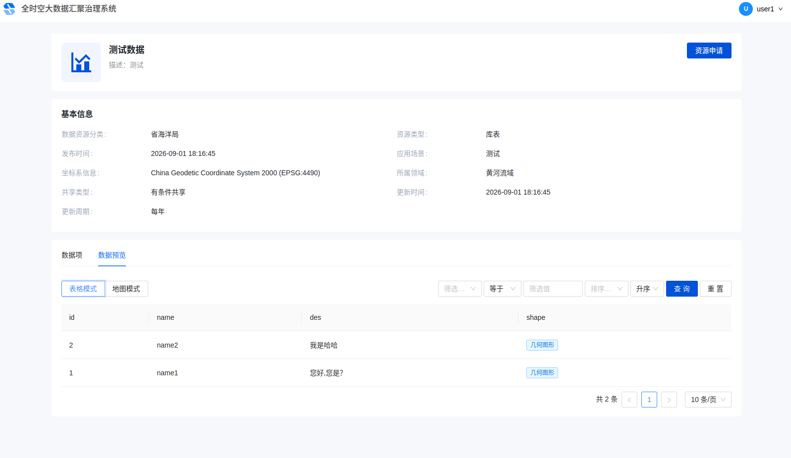
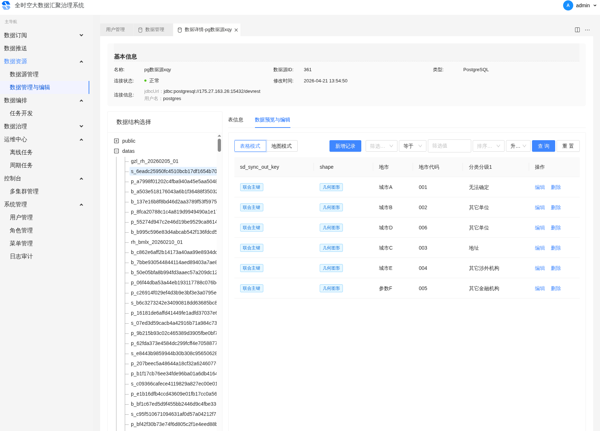
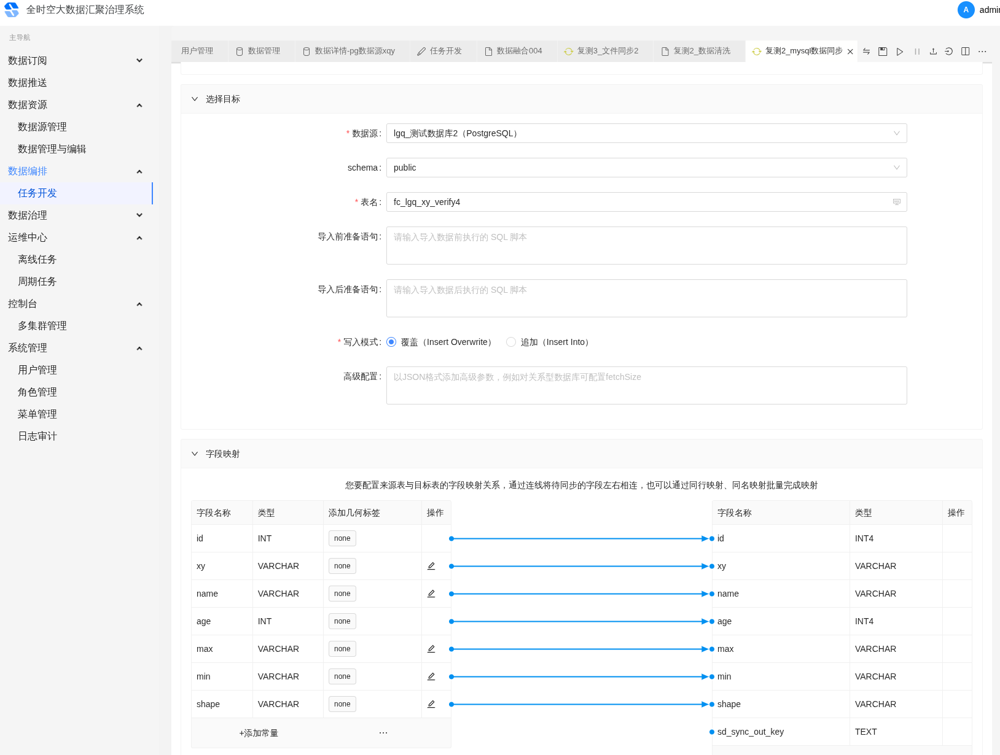
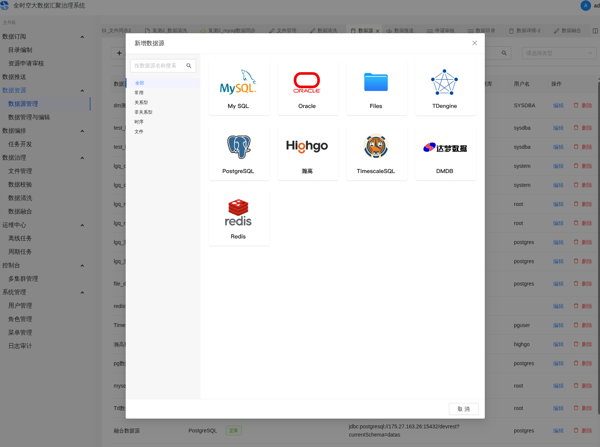

# 山东省数据治理平台

## 简介

山东省政务数据治理与流通平台，分两期交付。一期完成基础平台（前后端），二期扩展数据集成与任务调度能力。整合 9 种数据源，完成 58 项优化任务，支撑省级政务数据流通。

## 技术栈

### 一期 (sd-frontend + sd-java)

- **后端**: RuoYi-Vue PostgreSQL 版（Java + Spring Boot + MyBatis-Plus）
- **前端**: Vue 3 + Vite + Element Plus
- **数据库**: PostgreSQL
- **部署**: Nginx 静态部署

### 二期 (sd-chunjun + sd-taier)

- **数据集成**: ChunJun（分布式集成框架，基于 Apache Flink，支持 20+ 数据源同步）
- **任务调度**: Taier（分布式 DAG 调度系统，降低 ETL 成本）

## 核心功能

- 多源异构数据整合（9 种数据源）
- 离线与实时数据同步（ChunJun + Flink）
- 分布式任务调度与依赖管理（Taier DAG 可视化）
- 数据质量监控与脏数据管理
- 政务数据流通支撑（58 项优化任务按时交付）

## 示例

