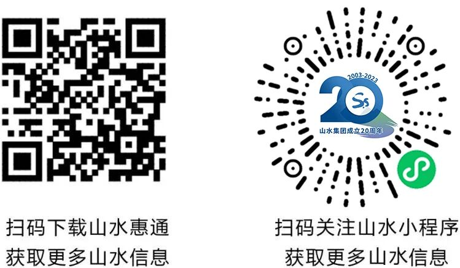
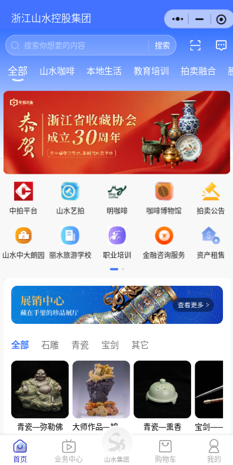
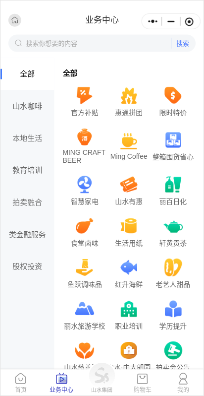
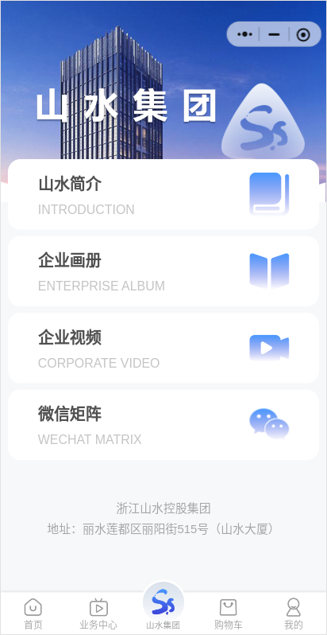

# 山水惠通

## 简介

企业级管理系统合集，包含商户管理、商城、拍卖、教育等多个业务系统。基于 Java 微服务（v3-ceres）与 .NET 两大技术栈双线开发，稳定运行多年。

## 技术栈

### Java 微服务 (v3-ceres-temp)

33 个微服务模块，按业务划分：

- **基础**: ceres-framework, ceres-common, ceres-authority, ceres-oauth, ceres-jobs
- **业务**: ceres-member, ceres-order, ceres-pay, ceres-product, ceres-shoppingcart
- **营销**: ceres-promotion, ceres-activity, ceres-distribution, ceres-cms
- **垂直**: ceres-education, ceres-sport, ceres-store, ceres-crafts, ceres-yichuang
- **支撑**: ceres-file, ceres-sms, ceres-qiniu, ceres-search, ceres-spider

### .NET 解决方案 (Projects-net)

- **BMS**: 商户管理系统
- **Mall**: 商城系统
- **Auction**: 拍卖系统
- **Center**: 会员中心
- **AppPayLib**: App 支付封装

### 前端

- **H5/小程序**: v3-ssht-ui（Vue + uni-app 跨端）
- **管理后台**: BMSWeb-net（.NET WebForms）

## 核心功能

- 商户管理与多租户
- 商城订单与支付
- 拍卖/活动/分销
- 教育/运动/门店垂直业务
- 统一认证与权限（OAuth）

## 链接

## 示例

